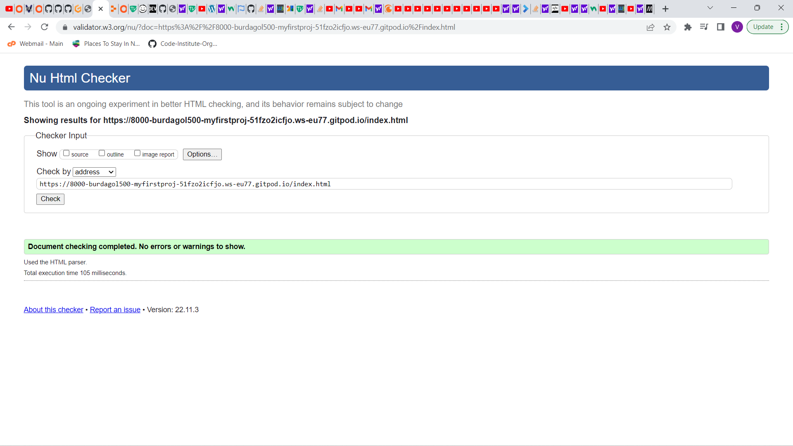
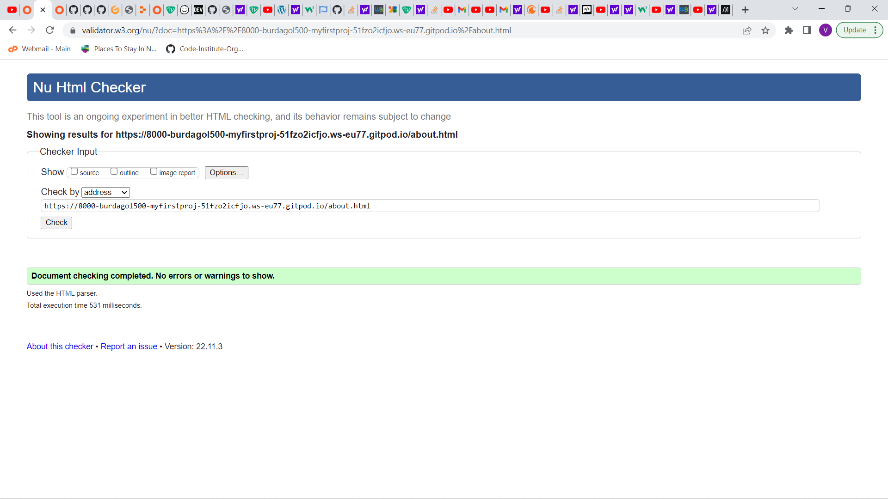
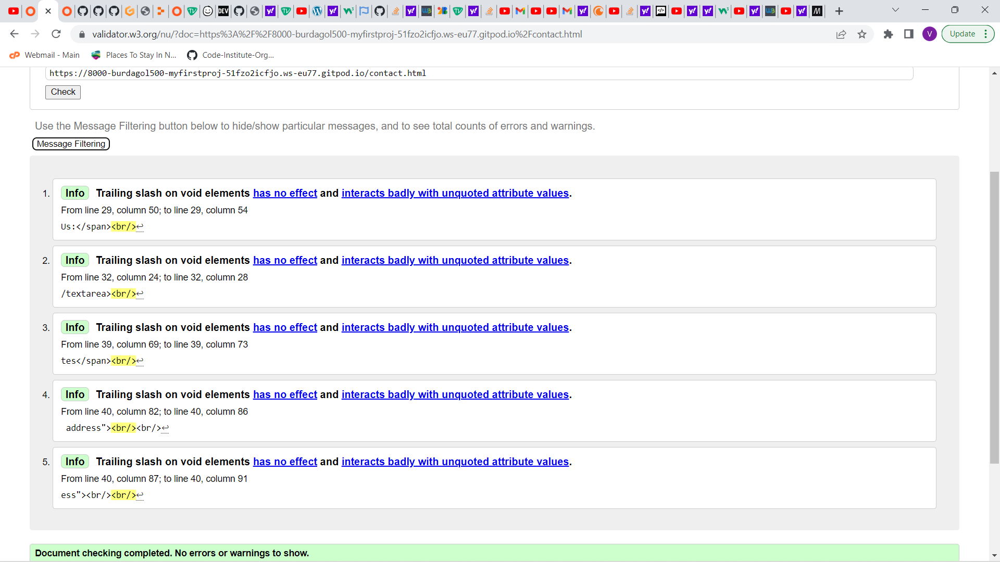
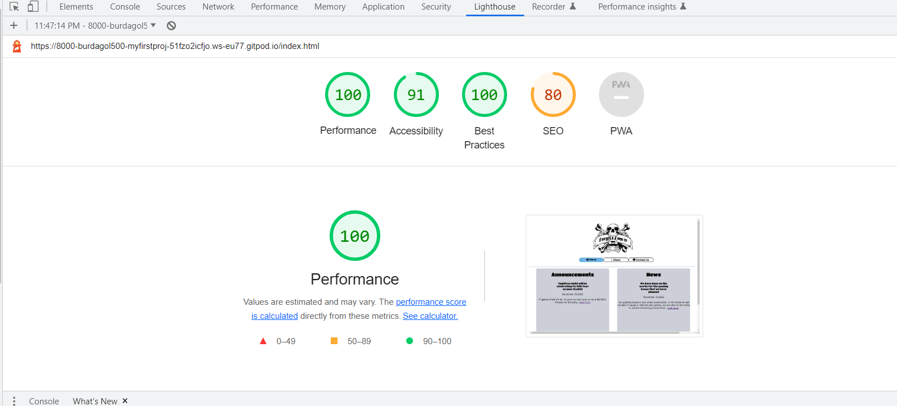

Fugitives Guild

This website is dedication for the present and Future Fugitives Guild members. We are an international group of gamers which started from the Philippines from the year 2013 up to the present. This website is dedicated for the Members, fans and people who are curious what is the Fugitives. We will be posting announcements for our guild events and also news of what is happening to our future projects.

As of now this is the start of the development of the website. We know its not that good looking but we promise to continue on developing the website for we will be getting some designerrs for the website itself. The website will be featuring some of our photos of our game bonding and in real life bonding. Also you may contact us for any suggestions or if you are interested in joining us. You may also subscribe to get news straight to your email address.

<h2>Features</h2>
Features a Navigation bar which consist of Home, About us page and Contact us page.  

On the Home page there we will post announcements and news for everyone to see.

The about us page tells what is the Fugitives Guild all about. 

Also Showcases some pictures from our ingame and real life bonding.

And lastly the contact us page has a form that you can give us a feedback or if you want to contact us for any questions, and if you want to subscribe to our newsletter. 

<h2>Validation</h2>
<h4> HTML Validation</h4>
Index.html
 

 
About.html

 
Contact.html

 
Style.css

Site Performance

<h2>Deployment</h2>

My Site was Deployed using Github Pages. The steps I took were as follows: 
1. On the repository Page, Click on the settings icon.  
2. On the left hand side corner click pages on the menu. 
3. On the branch selected Main, then on the folder selected root then clicked save.
4. After a few minutes Github has generated my website which has a URL of: https://burdagol5000.github.io/MyFirstProject/

<h2>Credits</h2>

<ul>
<li>Icons used where from Font Awesome(https://fontawesome.com/)</li>
<li>Some fonts used were from Google Fonts(https://fonts.google.com/)</li>
<li>Flexbox tutorial from Kevin Powell on Youtube (https://www.youtube.com/@KevinPowell)</li>
<li>Some HTML and CSS Tutorial from SuperSimpleDev on Youtube (https://www.youtube.com/@SuperSimpleDev)</li>
<li>Form Validation from Code Institute LMS</li>
</ul>

<h3>Media</h3>

<ul>
<li>All Pictures were all taken from personal Facebook page (https://www.facebook.com/vicente.ponteras/)</li>
</ul>

